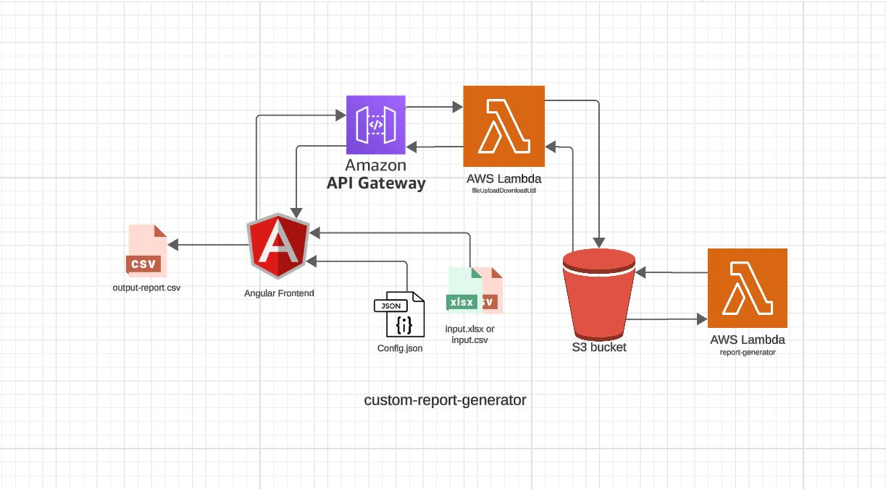
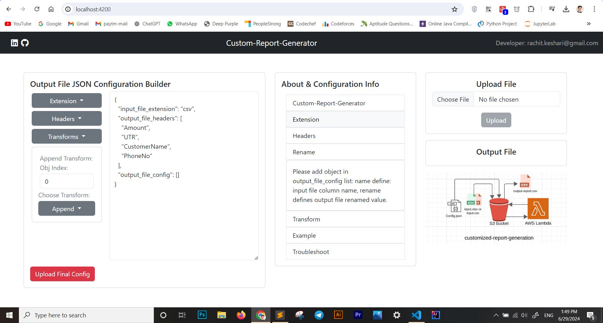

# Data Transformation and Report Generation Project

This project provides a seamless way to transform and generate customized reports from input CSV or XLSX files. It leverages AWS services (Serverless Architechture) using AWS Lambda function. This is a prototype project which has Core Java code deployed over both the Lambda function, that uses inputStream event, input context in lambda handleRequest method to fetch meta data for files to read and process those files.

[](https://www.youtube.com/watch?v=DiSz4j0-7H0)

Link: [youtube](https://www.youtube.com/watch?v=DiSz4j0-7H0)

## Overview
### HLD:

### Frontend:


- **Framework**: Angular
- **Purpose**: Provides a user-friendly interface to upload configuration and input files, and to download the generated report.

### Backend

- **Services**: AWS API Gateway, AWS Lambda, AWS S3
- **Purpose**: Handles file uploads, transformations based on configuration, and stores the processed reports for download.

## Workflow

1. **Upload Configuration**:
    - The user uploads a configuration JSON file via the frontend.
    - The configuration file is sent to an AWS S3 bucket through API Gateway and AWS Lambda.

2. **Upload Input File**:
    - The user uploads an input CSV or XLSX file.
    - The input file is stored in an S3 bucket in the "unprocessed" directory.

3. **Processing**:
    - An AWS Lambda function is triggered upon the upload of the input file.
    - This function reads the configuration and input files, performs the necessary transformations, and generates the output report.
    - The output report is saved in the "processed" directory in the S3 bucket.

4. **Download Report**:
    - The frontend periodically checks if the processed file is available.
    - Once available, the user can download the report or open it in a new tab.

## Technologies Used

### Frontend
- Angular
- Bootstrap for styling

### Backend
- AWS S3 for file storage
- AWS Lambda for serverless processing
- AWS API Gateway for API management

## Installation and Setup

### Frontend

1. **Clone the repository**:
    ```sh
    git clone https://github.com/your-username/your-repo-name.git
    cd your-repo-name/frontend
    ```

2. **Install dependencies**:
    ```sh
    npm install
    ```

3. **Run the development server**:
    ```sh
    ng serve
    ```
    - The application will be available at `http://localhost:4200`.

### Backend

1. **Set up AWS resources**:
    - Create S3 buckets for configuration, unprocessed, and processed files.
    - Set up AWS Lambda functions for handling file uploads and processing.
    - Configure AWS API Gateway to route requests to the Lambda functions.

2. **Deploy Lambda functions**:
    - Package and deploy the Lambda functions using AWS CLI or AWS Management Console.

### Environment Configuration

- **Frontend**: Set the API URL in `src/environments/environment.ts` and `src/environments/environment.prod.ts`.

    ```typescript
    export const environment = {
      production: false,
      apiUrl: 'https://your-api-url.amazonaws.com/prod'
    };
    ```

- **Backend**: Ensure that your Lambda functions have the necessary permissions to read and write to S3 buckets.

## Usage

1. **Upload Configuration File**:
    - Navigate to the "Upload Config" section in the application.
    - Select and upload the configuration JSON file.

2. **Upload Input File**:
    - Navigate to the "Upload Input File" section.
    - Select and upload the CSV or XLSX file.

3. **Download Report**:
    - After processing, navigate to the "Download Report" section.
    - Click on the "Download" button to save the report locally or "Open in New Tab" to view it directly.

## Example Configuration JSON

```json
{
  "input_file_extension": "csv",
  "output_file_headers": [
    "Amount", "UTR", "CustomerName", "PhoneNo"
  ],
  "output_file_config": [
    {
      "name": "amount",
      "rename_to": "Amount",
      "transform": "ConvertToRupee"
    },
    {
      "name": "utr",
      "rename_to": "UTR",
      "transform": "RemoveFromStart:XDS35|AddLeadingZeros:18"
    },
    {
      "name": "ph.no",
      "rename_to": "PhoneNo",
      "transform": "LimitLengthFromBack:10|AddPrefix:+91 "
    },
    {
      "name": "name",
      "rename_to": "CustomerName"
    }
  ]
}
```

## Video Demonstration

Watch the video demonstration of the project on [YouTube](https://www.youtube.com/watch?v=DiSz4j0-7H0) to see the application in action.


